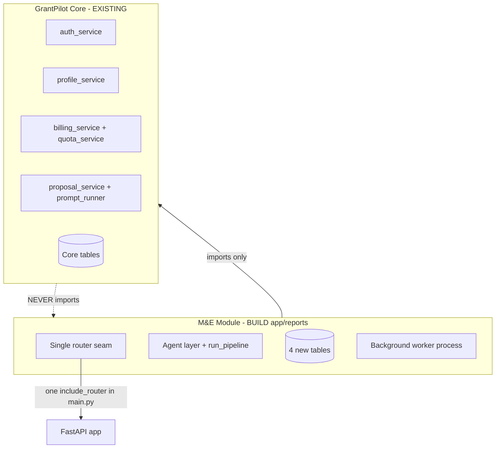

# M&E Module — Orientation Report (Read-Only)

> **Purpose.** Implementation-engineer orientation after reading all M_E_Module planning artefacts and exploring the GrantPilot repository. No product code was written in this pass.
>
> **Date:** 2026-05-24 · **Module status:** Pre-build (Stage A not yet drafted)

---

## (a) Understanding check

### What the M&E module is

The **Donor Report Writer** (working name: GrantPilot Reports) is a **post-award** product for NGOs that have already won a grant. Users upload messy real-world artefacts — winning proposal, grant letter/MoU, indicator spreadsheets, photos, decks — and a **Level-2 agentic pipeline** (bounded specialists + orchestrator) extracts, reconciles, and gap-checks that material against a **funder-specific report template**, then synthesises a **funder-ready narrative** and exports a **formatted Word document**. Humans own truth at **three server-enforced gates**: confirm facts (Gate 1), answer only genuine gaps (Gate 2), review critic flags and edit (Gate 3). Positioning: *"GrantPilot helps you win the grant. Then it helps you keep the funder."*

It is **not** field data collection, dashboards, logframe management, or autonomous Level-3 agents.

### Relationship to the existing proposal product

| Dimension | Pre-award (existing) | Post-award (M&E) |
|-----------|---------------------|------------------|
| Job | Win the grant | Keep the funder |
| Primary entity | [`proposals`](../app/models/proposal.py) | `donor_reports` (planned) |
| Template source | [`FundingOpportunity.requirements_json`](../app/models/funding_opportunity.py) | `funder_report_templates` (planned) |
| Generation pattern | [`ProposalService`](../app/services/proposal_service.py) → sections via [`run_prompt`](../app/ai/prompt_runner.py) | `ReportService` (planned mirror) → synthesis agents |
| Export | [`ExportService`](../app/services/export_service.py) via **python-docx** | **docxtpl** + hand-built funder `.docx` templates (planned) |
| Bridge | — | `linked_proposal_id` FK when grant was won via GrantPilot |

Both products share **auth, NGO profile, billing/quotas, email, PostgreSQL**, and the **Impact Pro** tier ($99/mo) carries **both** proposal credits (inherited from Impact) and **2 M&E reports/month**. Three entry paths (NGOInfo discovery, direct GrantPilot, new M&E-only "won anywhere" door) all converge on the same core.

### Modular monolith principle



Four isolation rules (from [ME_MODULE_MASTER_MEMORY.md](ME_MODULE_MASTER_MEMORY.md) §10):

1. **One-way dependency** — M&E imports core; core never imports M&E (hook-enforced in Stage A).
2. **One mounting seam** — entire API via a single `include_router` in [`app/main.py`](../app/main.py); frontend behind one feature flag.
3. **Separate data, FKs inward only** — 4 new tables may FK to `users`, `proposals`; no core table FKs back; no core migrations altered for M&E.
4. **Separate runtime** — agent pipeline in a **background worker**, not the sync API path.

Three kill switches: un-mount router + UI flag off; scale worker to 0; drop 4 M&E tables.

---

## (b) Reuse map confirmation

### Reuse / mirror (actual files found)

| M&E need | Existing GrantPilot artefact | Path |
|----------|------------------------------|------|
| HTTP app + error envelope | FastAPI monolith | [`app/main.py`](../app/main.py) |
| Route → service pattern | Domain routers + services | [`app/api/routes/proposals.py`](../app/api/routes/proposals.py), [`docs/artefacts/REPO_STRUCTURE_AND_SERVICE_PATTERNS.md`](../docs/artefacts/REPO_STRUCTURE_AND_SERVICE_PATTERNS.md) |
| Report service mirror | Proposal lifecycle + partial success | [`app/services/proposal_service.py`](../app/services/proposal_service.py) — `create_proposal`, `_generate_sections`, `ThreadPoolExecutor`, `DEGRADED`-style persistence |
| Input adapter mirror | Prompt inputs builder | [`app/ai/prompt_inputs_builder.py`](../app/ai/prompt_inputs_builder.py) — `build_prompt_inputs()` |
| Section synthesis | Prompt runner + archetypes + humaniser | [`app/ai/prompt_runner.py`](../app/ai/prompt_runner.py), [`app/ai/prompts/proposal.py`](../app/ai/prompts/proposal.py), [`docs/artefacts/OPENAI_PROMPTS_LIBRARY.md`](../docs/artefacts/OPENAI_PROMPTS_LIBRARY.md) |
| OpenAI client | HTTP completions wrapper | [`app/integrations/openai_client.py`](../app/integrations/openai_client.py) |
| DOCX export *pattern* (quota, idempotency) | Export service | [`app/services/export_service.py`](../app/services/export_service.py) — idempotency via [`record_usage`](../app/services/quota_service.py) |
| Auth + JWT plan claim | Auth service + security | [`app/services/auth_service.py`](../app/services/auth_service.py), [`app/core/security.py`](../app/core/security.py) — JWT `plan` claim |
| Auth guard | Dependency | [`app/api/dependencies/auth.py`](../app/api/dependencies/auth.py) — `get_current_user` |
| Quota / entitlements | Quota + entitlements route | [`app/services/quota_service.py`](../app/services/quota_service.py), [`app/api/routes/entitlements.py`](../app/api/routes/entitlements.py) |
| Stripe billing | Checkout, portal, webhooks | [`app/services/billing_service.py`](../app/services/billing_service.py), [`app/api/routes/billing.py`](../app/api/routes/billing.py) |
| NGO profile + knowledge bank | Profile service | [`app/services/profile_service.py`](../app/services/profile_service.py), [`app/models/ngo_profile.py`](../app/models/ngo_profile.py) — `knowledge_bank` JSONB |
| Email lifecycle | Resend integration | [`app/services/email_service.py`](../app/services/email_service.py) |
| Migrations discipline | Alembic hand-written revisions | [`alembic/versions/`](../alembic/versions/) (head: `0013_ngo_profiles_knowledge_bank`) |
| Contract docs to extend | API, prompts, pricing, guardrails | [`docs/artefacts/API_CONTRACT.md`](../docs/artefacts/API_CONTRACT.md), [`PROMPT_INPUTS_FIELD_MAPPING.md`](../docs/artefacts/PROMPT_INPUTS_FIELD_MAPPING.md), [`PRICING_AND_ENTITLEMENTS.md`](../docs/artefacts/PRICING_AND_ENTITLEMENTS.md), [`GUARDRAILS_RUNTIME_AND_SECURITY.md`](../docs/artefacts/GUARDRAILS_RUNTIME_AND_SECURITY.md), [`ENV_VARS_REFERENCE.md`](../docs/artefacts/ENV_VARS_REFERENCE.md) |

### Genuinely new (BUILD)

| Component | Notes |
|-----------|-------|
| **Agent layer** (10 agents + orchestrator) | Claude Agent SDK; built under `app/reports/agents/`; Claude Code's domain |
| **4 new tables** | `donor_reports`, `funder_report_templates`, `uploaded_documents`, `report_jobs` |
| **Document intake** | Upload → Railway Buckets → Docling extraction |
| **Knowledge-bank reconciler** | Per-report `knowledge_bank_json` (distinct from profile `knowledge_bank`) |
| **Gap/compliance + fact-safety critic** | Funder-template-aware; no OSS equivalent |
| **Background worker + `run_pipeline(report_id)`** | Not present today ([`Procfile`](../Procfile) is `web` + `release` only) |
| **docxtpl export engine + 10 funder templates** | Different from proposal's programmatic python-docx |
| **Impact Pro tier + report quota** | Not in current [`UserPlan`](../app/models/user_plan.py) CHECK or [`PRICING_AND_ENTITLEMENTS.md`](../docs/artefacts/PRICING_AND_ENTITLEMENTS.md) |

### External REUSE (not yet in repo)

Docling, Claude Agent SDK, docxtpl, Railway Buckets, cheap multimodal vision API, n8n (post-launch template ingestion).

---

## (c) Proposed folder / package structure

**Important.** This `M_E_Module/` folder holds **planning and reference artefacts only**. Runtime code lives under `app/reports/` per the locked isolation design. Stage A will produce `REPO_MAP_ME_MODULE.md` at repo root documenting this boundary.

### Proposed directory tree

```
app/reports/                          # ISOLATED M&E package — all new module code here
  __init__.py
  router.py                           # THE MOUNTING SEAM — aggregates sub-routers
  api/
    routes/
      reports.py                      # POST/GET/PATCH /api/reports/...
      report_templates.py             # GET /api/report-templates
    dependencies/
      entitlements.py                 # report quota guard (imports core quota_service)
  models/
    donor_report.py
    funder_report_template.py
    uploaded_document.py
    report_job.py
  schemas/
    report.py
    ...
  services/
    report_service.py                 # mirrors proposal_service
    report_inputs_builder.py          # mirrors prompt_inputs_builder
    document_storage_service.py       # Railway Buckets
    report_export_service.py          # docxtpl (separate from core ExportService)
  extraction/
    docling_adapter.py
  agents/                             # Claude Code builds this subtree
    orchestrator.py
    classifier.py
    ...
  worker/
    __main__.py                       # worker entrypoint
    run_pipeline.py                   # swappable execution interface
    job_runner.py
  templates/
    docx/                             # 10 hand-designed .docx templates

alembic/versions/
  0014_me_module_*.py                 # new migrations only; FKs inward; no core table changes

scripts/
  start_worker.sh                     # optional; or Procfile worker: line

M_E_Module/                           # REFERENCE ONLY — not imported at runtime
  ME_MODULE_*.md / *.html
```

### Single mounting seam (backend)

In [`app/main.py`](../app/main.py), gated by env flag (to be spec'd in Stage B):

```python
# After existing routers — the only place core touches M&E
if settings.ME_MODULE_ENABLED:
    from app.reports.router import router as reports_router
    app.include_router(reports_router)
```

`app/reports/router.py` owns prefix `/api` and includes `reports` + `report_templates` sub-routers. **Core files must not import from `app.reports`.**

### Single mounting seam (frontend — spec only; not in this repo)

Per [ME_MODULE_WIREFRAMES_BRANDED.html](ME_MODULE_WIREFRAMES_BRANDED.html): routes under `/reports/*`, nav entry + 8 screens hidden behind `NEXT_PUBLIC_ME_MODULE_ENABLED` (name TBD in Stage B). Frontend lives in a **separate Next.js codebase** (deployed at grantpilot.ngoinfo.org per [`docs/artefacts/FRONTEND_ARCHITECTURE_SPEC.md`](../docs/artefacts/FRONTEND_ARCHITECTURE_SPEC.md)); **this repo is backend-only**.

### Worker process (Stage C)

Add to [`Procfile`](../Procfile):

```
worker: python -m app.reports.worker
```

Runtime kill switch = scale worker service to 0 on Railway.

---

## (d) Risks and gaps

### Doc vs codebase conflicts

| Issue | Planning docs say | Repo reality | Risk |
|-------|-------------------|--------------|------|
| **DOCX engine** | docxtpl for M&E export | [`export_service.py`](../app/services/export_service.py) uses **python-docx** programmatically; `docxtpl` not in [`requirements.txt`](../requirements.txt) | Expected divergence for funder templates — but internal diagram labels "DOCX utilities" as shared core; M&E should **not** modify core export |
| **Frontend** | Next.js 8-screen journey | **No frontend source in this repo** | Stage I work happens elsewhere; API contract must be self-sufficient |
| **Background worker** | Separate Railway worker | **No worker process** in Procfile or codebase | Net-new infra in Stage C |
| **Impact Pro tier** | $99/mo, 2 reports/mo | [`UserPlan`](../app/models/user_plan.py) CHECK: `FREE \| GROWTH \| IMPACT` only; [`PRICING_AND_ENTITLEMENTS.md`](../docs/artefacts/PRICING_AND_ENTITLEMENTS.md) stops at Impact $79 | Stage J extends billing; plan slug naming TBD |
| **Object storage** | Railway Buckets | No S3/bucket client in repo | Net-new primitive |
| **Uploads on Free/Growth** | M&E ingests documents | Core pricing doc: "Uploads: Not allowed" on all current tiers | Impact Pro upload entitlement needs explicit spec in Stage B |

### Doc-internal inconsistencies (resolve in Stage B)

| Topic | Conflict |
|-------|----------|
| **JSONB column names** | [ME_MODULE_ARCHITECTURE_SPEC.md](ME_MODULE_ARCHITECTURE_SPEC.md) / master memory: `report_sections`, `format_rules`, `terminology_map` — [ME_MODULE_INTERNAL_ARCHITECTURE.html](ME_MODULE_INTERNAL_ARCHITECTURE.html): `report_sections_json`, `format_rules_json`, `terminology_map_json` |
| **UI colour language** | Master memory §14: teal/plum/orange — wireframes + brand: purple (agent) / blue (gate) / navy (action) |
| **Missing companion docs** | Master memory references `ME_AGENTIC_REUSE_MAP.md`, `ME_COMPLIANCE_MARKET_RESEARCH.md` — **not present** in this folder |

### Column-name / contract drift risks (high — prior build broke here)

The existing codebase **already uses Python↔DB name aliasing** as a lesson learned:

```python
# app/models/usage_ledger.py
event_type: Mapped[str] = mapped_column("action_type", Text, ...)
occurred_at: Mapped[DateTime] = mapped_column("created_at", ...)
metadata_json: Mapped[dict] = mapped_column("metadata", JSONB, ...)
```

**Drift hotspots for M&E Stage B/C:**

1. **All 4 new tables** — migration SQL column names must exactly match `mapped_column("db_name", ...)` in models AND `DB_FIELD_CONTRACT_*` docs. Stage A migration-parity hook targets this.
2. **`knowledge_bank` vs `knowledge_bank_json`** — NGO profile uses `knowledge_bank`; donor report uses `knowledge_bank_json`. Intentionally separate domains but easy to confuse in services/API responses.
3. **`usage_ledger.action_type`** — adding `REPORT_CREATE` / `REPORT_EXPORT` must use DB column `action_type`, not Python name `event_type`.
4. **`alembic/env.py`** — imports only 7 models; `Proposal`, `StripeEvent`, `FundingOpportunity` omitted. Migrations are hand-written (works today) but autogenerate/compare would miss tables. New M&E models must be added to env imports if parity checks rely on metadata.
5. **API contract vs Pydantic schemas** — prior audit noted frontend/backend response shape mismatches (e.g. `ngo_profile` wrapper). M&E endpoints need locked envelopes in Stage B before any route code.
6. **Enum values** — report `status`, job `stage`/`status`, document `classification` must align across migration CHECK constraints, SQLAlchemy models, Pydantic schemas, and [`ENUM_REGISTRY.md`](../docs/artefacts/ENUM_REGISTRY.md).

### Operational risks (acknowledged in docs)

- Multi-agent cost vs $49.50/report revenue ceiling — mitigated by cheap/strong split + `agent_trace_json`
- Single-instance rate limiting ([`app/core/rate_limit.py`](../app/core/rate_limit.py)) — worker + API on same image is fine for MVP; multi-replica would bypass limits
- Workstream T2 (NLCF + FCDO dossiers) gates Stage B — template sourcing is on the critical path

---

## (e) Stage A readiness

The **immediate next turn is Stage A only** — governance scaffold, **no product code**:

| Step | Deliverable |
|------|-------------|
| A1 | `.cursor/rules/` (global, isolation, backend, agents, scope-fence) + `CLAUDE.md` |
| A2 | `REPO_MAP_ME_MODULE.md` |
| A3 | `ME_MODULE_KILL_SWITCH.md` |
| A4 | `ME_MODULE_DECISION_LOG.md` (seeded with locked decisions) |
| A5 | Copy architecture spec + wireframes into repo (reference location TBD) |
| Hard layer | `.cursor/hooks/` + `.claude/hooks/` — Python scripts: isolation veto, migration-parity, secret-scan |

**Exit gate:** rules, repo map, kill-switch doc, and hooks agree on **one boundary** and **one seam**. If the kill-switch doc cannot be written cleanly, isolation design is incomplete.

**Stage B (spec lock)** follows — 4 field contracts, `FUNDER_TEMPLATE_SCHEMA.md`, NLCF+FCDO stress test, `REPORT_INPUTS_FIELD_MAPPING.md`, `API_CONTRACT.md` M&E section. **No product code until Stage B completes.**

**Stage C** is first code — empty module skeleton + kill-switch rehearsal on the empty module.

**Parallel:** Workstream T1 (grantee report outreach) should start now; T2 blocks Stage B.

---

## Wireframes and brand (brief)

[ME_MODULE_WIREFRAMES_BRANDED.html](ME_MODULE_WIREFRAMES_BRANDED.html) defines **8 screens**:

1. Dashboard (`/reports`) — "Won a grant anywhere?"
2. Choose grant + funder template
3. Upload documents (drag mess)
4. Watch agents work (job progress + cost meter)
5. Gate 1 — confirm facts / resolve conflicts
6. Gate 2 — fill only gaps (readiness score)
7. Gate 3 — review with critic flags
8. Export — funder DOCX + duplicate-for-next-period

[NGOINFO_BRAND_GUIDELINES.md](NGOINFO_BRAND_GUIDELINES.md): DM Sans, navy `#1A1F71`, purple `#6D35FF`, 8px grid — aligned with wireframes. GrantPilot workspace UI also documented in [`docs/artefacts/BRAND_AND_FRONTEND_SPEC.md`](../docs/artefacts/BRAND_AND_FRONTEND_SPEC.md).

---

## Clarifications needed before Stage A

1. **Frontend repo location** — Is the Next.js app in a separate repository/worktree? Stage A/I need to know where the frontend feature flag and `/reports` routes will live.
2. **Missing companion docs** — Are `ME_AGENTIC_REUSE_MAP.md` and `ME_COMPLIANCE_MARKET_RESEARCH.md` available elsewhere, or should Stage A treat the master memory reuse section as sufficient?
3. **Impact Pro plan slug** — New enum value `IMPACT_PRO` (extends `UserPlan` CHECK + Stripe price ID), or overload `IMPACT` with added entitlements?
4. **JSONB column naming convention** — Canonical for Stage B: suffix `_json` on all JSONB columns (per internal diagram) or bare names (`report_sections`) per architecture spec?
5. **Stage A artefact drop location** — Where should copied spec/wireframes live in-repo: `docs/artefacts/me_module/`, root-level `M_E_Module/` (as now), or elsewhere?
6. **Railway Buckets** — Already provisioned on Railway, or net-new setup in Stage C?
7. **UI semantic colours** — Wireframes (purple/blue/navy) vs master memory §14 (teal/plum/orange): which is authoritative for implementation?

---

*Companion artefacts in this folder: [ME_MODULE_MASTER_MEMORY.md](ME_MODULE_MASTER_MEMORY.md), [ME_MODULE_ARCHITECTURE_SPEC.md](ME_MODULE_ARCHITECTURE_SPEC.md), [ME_MODULE_PROJECT_PLAN.md](ME_MODULE_PROJECT_PLAN.md), wireframes and internal architecture HTML.*
