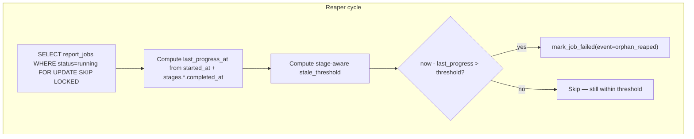
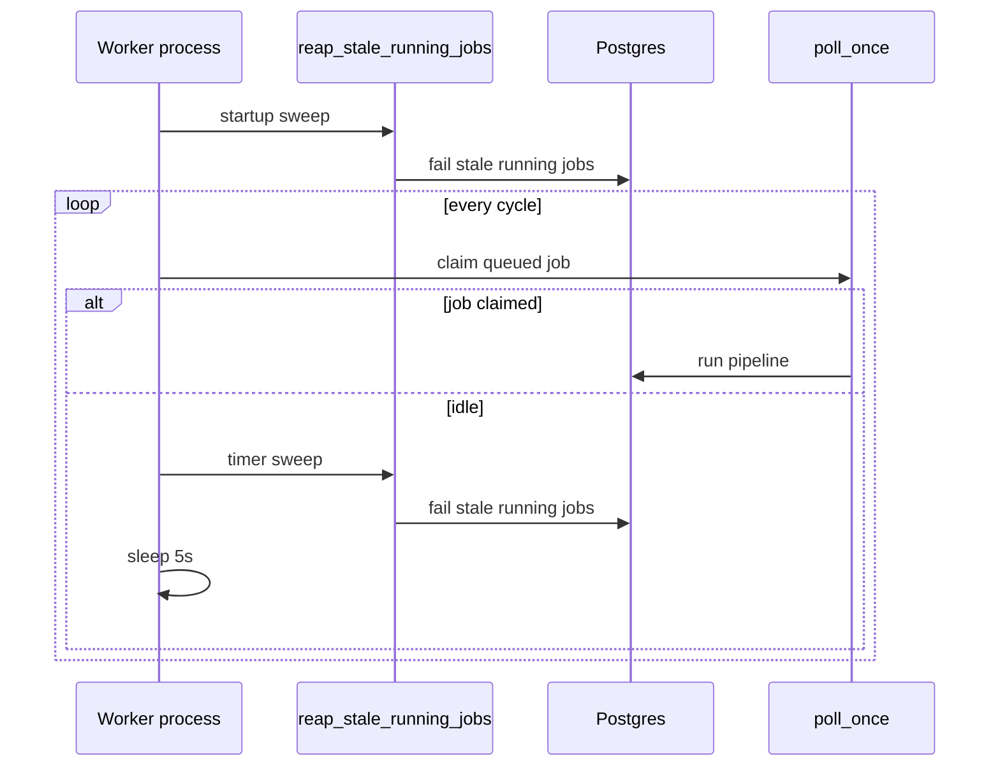

# P3 — Never hang (worker liveness / orphan reaper)

**Status:** Plan for owner approval — **no code, no DB, no worker changes until approved.**

**Package tier:** Amber (P3) — coupled with P2/P4 sequentially; build only after this plan is approved.

**Authority:** [CURSOR_BUILD_INSTRUCTIONS.md](./CURSOR_BUILD_INSTRUCTIONS.md) · locked **D3 Route A** (no migration) · locked **D4** (fail-and-surface via `mark_job_failed`, no requeue).

---

## Repo roots (verified)

| Role | Path |
|------|------|
| **Backend (build target)** | `C:\Users\prana\OneDrive\Desktop\NGOInfo-Grantpilot\` — `app/main.py`, `app/reports/`, git toplevel |
| **Frontend (reference only)** | `C:\Users\prana\OneDrive\Desktop\NGOInfo-Grantpilot\ngoinfo-grantpilot-frontend\` — `package.json` name `"frontend"` |
| **Do NOT use** | `…\NGOInfo-Grantpilot\frontend\` — phantom stub |

Worker entry: `Procfile` → `python -m app.reports.worker` → [`app/reports/worker/__main__.py`](../app/reports/worker/__main__.py) → `run_forever()` in [`job_runner.py`](../app/reports/worker/job_runner.py).

---

## Problem statement

Today a worker process death mid-job leaves `report_jobs.status = running` indefinitely:

- `claim_next_job` only picks `queued` rows ([`job_runner.py`](../app/reports/worker/job_runner.py) L29–65).
- `ME_WORKER_JOB_TIMEOUT_SECONDS` (default **3600**) only applies while the worker thread is alive inside `_execute_job_with_timeout` (L68–80).
- If the **process** dies (OOM, SIGKILL, deploy crash), no timeout fires and no code marks the job failed.

Observed prod case (NLCF audit): job stuck `running` at `extract` ~18+ minutes after worker loss.

**P3 scope:** Detect stale `running` jobs and route them through **`mark_job_failed`** (D4). **Out of scope:** preventing worker death (OOM, Railway stability, restart policy).

---

## Locked constraints (do not deviate)

| Decision | Requirement |
|----------|-------------|
| **D3 Route A** | No Alembic migration. No `heartbeat_at` / `updated_at` on `report_jobs`. Liveness inferred from `started_at` + `agent_trace_json.stages.*.completed_at`. |
| **D4** | Fail-and-surface only. **No auto-requeue.** Call existing `mark_job_failed` / `mark_job_failed_by_id`. |
| **Scope fence** | Worker liveness + reaper only. Do not redesign pipeline stages, gate state machine, or quota model (refund on fail stays as-is). |

---

## 1. Orphan detection mechanism (D3 Route A)

### 1.1 What counts as “durable progress”

Per [`DB_FIELD_CONTRACT_REPORT_JOBS.md`](../docs/artefacts/me_module/DB_FIELD_CONTRACT_REPORT_JOBS.md) §2.4, the orchestrator writes **`agent_trace_json.stages.{stage_name}.completed_at`** only when a stage **finishes** (via `_commit_checkpoint` / gate halts in [`pipeline.py`](../app/reports/orchestration/pipeline.py)). There is **no** in-stage heartbeat or per-document extract checkpoint in committed code today.

**Durable progress timestamps for a job:**

```python
last_progress_at = max(
    job.started_at,
    *(parse_iso(stages[s]["completed_at"]) for s in stages if stages[s].get("completed_at")),
)
```

Where `stages = (job.agent_trace_json or {}).get("stages") or {}`.

If `stages` is empty (job claimed, pipeline not yet committed first checkpoint), **`last_progress_at = job.started_at`**.

**What “no durable progress” looks like:**

- `status == running`
- `failure` not present in `agent_trace_json` (job not already terminal)
- `now - last_progress_at > stale_threshold(job)` (see §2)
- No new `stages.{current_or_prior_stage}.completed_at` since that timestamp

**Important limitation (document, do not hide):** During a long **in-flight stage** (especially `extract`), the worker may be healthy but **`completed_at` does not advance** until the entire stage completes. The reaper therefore measures silence since the **last stage boundary**, not since the last agent call. Threshold must be sized for worst-case **whole-stage** duration (§2).

### 1.2 Orphan candidate definition

A job is an **orphan candidate** when **all** hold:

1. `status == running`
2. `finished_at IS NULL`
3. `now - last_progress_at > compute_stale_threshold(job, doc_count, section_count)`
4. Not excluded by idempotency guard (§5)

Gate jobs (`awaiting_human`) are **never** reaped — they are not `running` and represent intentional human pauses.

### 1.3 Detection flow



---

## 2. Staleness threshold (crux)

### 2.1 Why stage-aware thresholds are required

Agent timeouts from **committed defaults** (env-overridable):

| Component | Default | Notes |
|-----------|---------|-------|
| Classifier | 60s/doc | [`classifier.py`](../app/reports/agents/classifier.py) `ME_CLASSIFIER_TIMEOUT_SECONDS` |
| Proposal / grant extract | 90s × **2 attempts** = 180s/doc | [`proposal_extractor.py`](../app/reports/agents/proposal_extractor.py), same for grant |
| Indicator extract | 180s × **1 attempt** | [`indicator_data_extractor.py`](../app/reports/agents/indicator_data_extractor.py) |
| Reconciler | 180s × **2 attempts** = 360s/stage | [`knowledge_bank_reconciler.py`](../app/reports/agents/knowledge_bank_reconciler.py) |
| Gap agent | 180s × **2 attempts** = 360s/stage | [`gap_compliance_agent.py`](../app/reports/agents/gap_compliance_agent.py) |
| Synthesis (OpenAI) | 90s × **2 attempts**/section (retry on timeout) | [`openai_client.py`](../app/integrations/openai_client.py) `_MAX_RETRIES=1`, httpx timeout 90s |
| Synthesis concurrency | **2** | `ME_SYNTHESIS_MAX_CONCURRENCY` |
| Fact-safety critic | **120s/section**, sequential | [`fact_safety_critic.py`](../app/reports/agents/fact_safety_critic.py) |
| Docling intake | **Unbounded in code** | [`docling_adapter.py`](../app/reports/extraction/docling_adapter.py) — no wall-clock cap |

**Per-document stages (`classify`, `extract`)** run documents **sequentially** with **one** `completed_at` at stage end — silence spans all documents.

**Bounded per-document agent ceiling (extract):**  
`T_extract_doc = max(180, 180, 180) = 180s` (proposal/grant/indicator degraded paths still consume wall time).

**Docling budget (engineering estimate, not a code constant):**  
Large PDFs have no timeout; use **`T_docling_doc = 300s` (5 min)** per text-extractable document as p99 planning estimate. Document explicitly in env so ops can tune without migration.

**Classify per-doc budget:** `T_classify_doc = T_docling_doc + 60 = 360s`.

**Extract per-doc budget:** `T_extract_doc = T_docling_doc + 180 = 480s`.

Let **`D`** = `COUNT(uploaded_documents WHERE donor_report_id = job.donor_report_id)` (runtime query).  
Let **`S`** = visible template section count from `funder_report_templates.report_sections_json` (runtime query).

### 2.2 Stage threshold formulas

| `job.stage` (cursor) | Max allowed silence since `last_progress_at` | Formula (seconds) |
|----------------------|-----------------------------------------------|-------------------|
| `classify` | All docs classified | `D * 360 + M` |
| `extract` | All docs extracted | `D * 480 + M` |
| `reconcile` | Reconciler completes | `360 + M` |
| `gap` | Gap agent completes | `360 + M` |
| `synthesise` | All sections generated | `ceil(S / 2) * 181 + M` |
| `critique` | All sections critiqued | `S * 120 + M` |
| `export` | Export completes | `300 + M` |

Where **`M = ME_ORPHAN_REAPER_MARGIN_SECONDS`** (default **900** = 15 minutes) — explicit safety margin for network variance, Docling p99 overshoot, and **reaper-vs-worker race** (§5).

**Synthesis wave term:** `181 = 90s timeout × 2 attempts + ~1s retry delay` per wave at concurrency 2.

**Example (NLCF-like, D=3, S=9, stage=extract, classify already completed):**

- Threshold = `3 × 480 + 900` = **`2340s` (~39 minutes)** since `stages.classify.completed_at`
- Prod orphan observed ~**18 min** — would **not** be falsely reaped at 18 min; reaped ~39 min if worker still dead
- Trade-off: safe against false reaps; orphan visibility slower than 18 min unless margin tuned down after prod evidence

**Example (D=1, stage=classify):**

- Threshold = `1 × 360 + 900` = **`1260s` (21 minutes)** since `started_at`

**Absolute backstop (optional env):** `ME_ORPHAN_REAPER_MAX_SECONDS` default **7200** (2h) — never reap if below stage threshold but job older than 2h with zero stages (pathological). Prevents infinite hang if formula mis-estimates; still << old indefinite hang.

### 2.3 Recommended env surface (no migration)

| Env var | Default | Purpose |
|---------|---------|---------|
| `ME_ORPHAN_REAPER_MARGIN_SECONDS` | `900` | Safety margin `M` |
| `ME_ORPHAN_REAPER_DOCLING_DOC_SECONDS` | `300` | Docling budget per doc (used in 360/480 formulas) |
| `ME_ORPHAN_REAPER_MAX_SECONDS` | `7200` | Absolute ceiling for `running` jobs with empty trace |

Formulas use docling constant from env in implementation:  
`classify: D * (docling + 60) + M`, `extract: D * (docling + 180) + M`.

---

## 3. Where the reaper runs

### 3.1 Proposed triggers

| Trigger | When | Catches |
|---------|------|---------|
| **A. Worker startup sweep** | Once at beginning of `run_forever()` before poll loop | Orphans left by **previous process death** on Railway restart/redeploy |
| **B. Worker idle timer** | Each `run_forever()` iteration when `poll_once()` returns 0 (same 5s cadence as today) | Orphans while worker is **alive but idle** between jobs |
| **C. Post-job hook** (optional) | After `_execute_job_with_timeout` returns (success or handled failure) | Fast cleanup before next claim — low priority, same code path as B |

**Recommendation:** Implement **A + B** in [`job_runner.py`](../app/reports/worker/job_runner.py) only (minimal seam). No API-process reaper in P3 (keeps worker concerns in worker).



### 3.2 Dead process with no restart

| Scenario | Covered by P3? |
|----------|----------------|
| Worker dies, Railway **restarts** worker | **Yes** — startup sweep (A) |
| Worker dies, process **stays down** | **No** — orphan persists until something starts worker again |
| Worker hung but process alive | **Partially** — `ME_WORKER_JOB_TIMEOUT_SECONDS` (3600s) + reaper (B) if event loop still ticks |

**Surface (do not fix in P3):** If Railway worker service does not auto-restart, reaper code alone cannot recover orphans. Requires infra: Railway restart policy, health check, or manual `python -m app.reports.worker` restart. Optional future: read-only reaper in a always-on API cron — **explicitly out of P3 scope**.

---

## 4. Interaction with one-active-job rule & failure UX

### 4.1 Active job statuses

[`donor_report_lifecycle_service.py`](../app/reports/services/donor_report_lifecycle_service.py):

```python
_ACTIVE_JOB_STATUSES = {queued, running, awaiting_human}
```

`enqueue_report_job` returns **409 `ACTIVE_JOB_EXISTS`** if any active job exists.

### 4.2 After reaping

`mark_job_failed` sets:

- `status = failed`
- `finished_at = now`
- `error` + `agent_trace_json.failure` (same shape as other failures)
- `REPORT_CREATE_REFUND` via existing quota path ([`job_failure.py`](../app/reports/worker/job_failure.py))

**`failed` ∉ `_ACTIVE_JOB_STATUSES`** → user can **Start over** (upload + re-enqueue) without 409.

### 4.3 Same UX as other failures

Frontend list chip uses `latest_job_status` (D5) → **"Generation failed" / Start over** — already live. Reaped jobs must use **`mark_job_failed`**, not a bespoke status, so chip/routing/refund match other failures.

Proposed failure metadata:

- `event`: new constant `FAILURE_EVENT_ORPHAN_REAPED = "orphan_reaped"` (worker-only string in trace; not a new API `error_code`)
- `message`: e.g. `"aborted: worker lost job mid-{stage}; no progress since {iso}"`

---

## 5. Idempotency, races, and safety

### 5.1 Double-fail / concurrent reapers

`mark_job_failed` returns **`False`** if status already in `{failed, done}` ([`job_failure.py`](../app/reports/worker/job_failure.py) L48–49).

Reaper implementation:

1. `SELECT … WHERE status='running' FOR UPDATE SKIP LOCKED` (one row at a time or small batch)
2. Recompute `last_progress_at` + threshold on locked row
3. If still stale → `mark_job_failed(session, job, …)`
4. Commit

Second reaper pass: row no longer `running` → skip.

### 5.2 Reaper vs worker finishing a stage (critical race)

During a long stage, the worker holds **no row lock** (commits only at stage boundary). Timeline:

1. Worker in `extract` for 25 min; last progress = `classify.completed_at`
2. Reaper reads `running`, threshold 39 min → **does not reap** at 25 min ✓
3. Worker commits `extract.completed_at` at 28 min → last progress advances
4. Reaper at 30 min → silence only 2 min since extract completed → **does not reap** ✓

**False reap risk** if threshold < actual stage duration. Mitigated by **`M = 900s`** and docling budget. If false reap occurs in prod, tune `ME_ORPHAN_REAPER_MARGIN_SECONDS` or docling budget **up**, never down without evidence.

**Conservative alternative if owner prefers:** require `now - started_at > ME_ORPHAN_REAPER_MAX_SECONDS` **in addition** to stage threshold for first ship — slower recovery, fewer false positives.

### 5.3 Reaper vs worker claiming same instant

Reaper only touches `running`. Worker only claims `queued`. **No claim collision.**

Worker may still be in `run_pipeline` for a `running` job while reaper evaluates it — addressed by threshold sizing + `FOR UPDATE` + re-check `status == running` immediately before `mark_job_failed`.

### 5.4 Jobs that must never be reaped

| Status | Reason |
|--------|--------|
| `queued` | Not started |
| `awaiting_human` | Intentional gate pause (may last days) |
| `failed` / `done` | Terminal |

---

## 6. Proposed implementation sketch (post-approval only)

**New module:** `app/reports/worker/orphan_reaper.py`

| Function | Responsibility |
|----------|----------------|
| `compute_last_progress_at(job) -> datetime` | Parse `started_at` + stage `completed_at` ISO strings |
| `compute_stale_threshold_seconds(job, *, doc_count, section_count) -> float` | §2 formulas |
| `reap_stale_running_jobs(session) -> int` | Query, lock, evaluate, `mark_job_failed`, return count reaped |

**Wire:** `job_runner.run_forever()` — startup + idle-cycle calls.

**Tests** (new `tests/test_orphan_reaper.py`):

- Synthetic `running` job with old `started_at`, empty stages → reaped
- Recent `classify.completed_at`, within extract threshold → **not** reaped
- Stale extract silence beyond `D*480+M` → reaped
- `awaiting_human` → never reaped
- Second reap → idempotent no-op
- After reap, `enqueue_report_job` succeeds (no 409)
- `mark_job_failed` failure trace shape asserted

**Contract touch:** None planned (failure is existing job status + trace). No new API fields.

---

## 7. Worker stability — surface only (not P3 fix)

From prior session audit (NLCF orphan):

- Worker likely **process death** mid-extract, not graceful `mark_job_failed`
- `.docx` classified as `indicator_data` → extract failure class (P2/P5 territory; **not** hang cause)
- `report_jobs` has no heartbeat (D3 Route A accepted)

**If worker dies repeatedly on clean runs:** prioritize **Railway stability** (memory, Docling footprint, restart policy) **before** relying on reaper as product UX. Reaper **recovers**; it does **not prevent** death.

**Priority order per sprint diagram:** P3 pre-check still applies — if clean walk shows worker cannot stay up, surface stability before treating reaper as sufficient.

---

## 8. Acceptance criteria (P3 done)

1. A `running` job whose worker process died reaches **`failed`** with clear `error` + `failure.event = orphan_reaped` within bounded time (stage threshold), never indefinite `running`.
2. After reap, owner can retry (no **409 `ACTIVE_JOB_EXISTS`**).
3. Reaper uses **D3 Route A** signals only — no migration.
4. Reaper uses **`mark_job_failed`** only — **D4**, no requeue.
5. Tests prove: reap, idempotency, no reap of fresh/slow-but-valid job within threshold, no reap of `awaiting_human`.
6. Threshold defaults documented in env reference + decision log entry.

---

## 9. STOP — awaiting owner approval

**No code, DB migration, or worker deployment changes until you approve this plan.**

**Decisions to confirm on approval:**

1. Default **`M = 900s`** (15 min margin) — accept ~39 min worst-case orphan visibility for D=3 extract vs faster but riskier?
2. **Startup + idle timer** triggers only — accept that dead worker with no restart stays orphaned until infra restart?
3. New trace event **`orphan_reaped`** — acceptable worker-only failure event string?

---

## Changelog

| Date | Author | Note |
|------|--------|------|
| 2026-06-08 | Cursor P3 diagnosis | Initial plan from read-only codebase trace |
